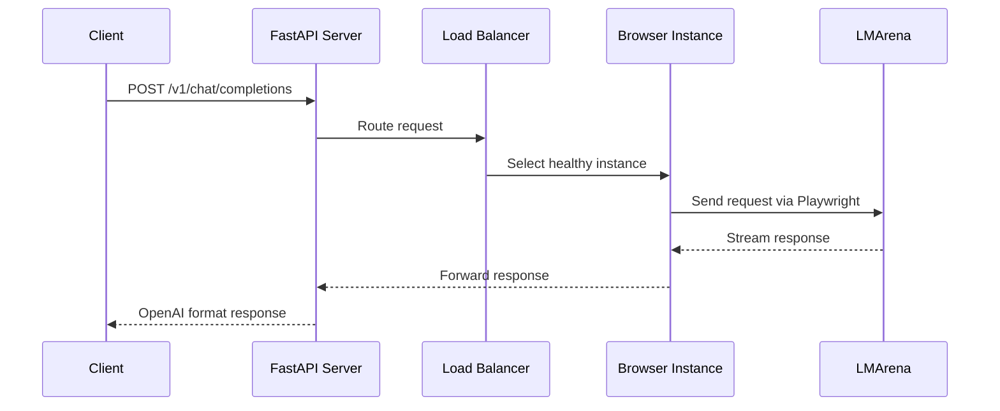
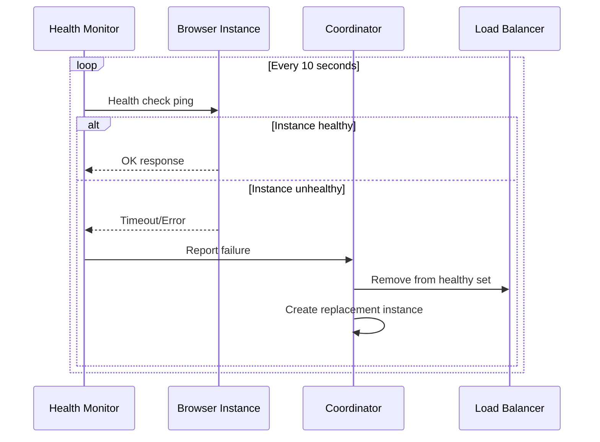

# 🚀 LMArenaBridge Multi-Instance Architecture Plan

## 📋 Project Overview

This document outlines the comprehensive plan to transform the current single-instance LMArenaBridge into a multi-instance system with GUI management, automatic failover, and parallel processing capabilities.

## 🎯 Objectives

- **Replace Tampermonkey** with Playwright-based browser automation
- **Multi-Instance Management** with automatic scaling and health monitoring
- **Web-based GUI** for real-time monitoring and control
- **Unified API Endpoint** maintaining backward compatibility
- **Parallel Processing** for improved throughput
- **Automatic Failover** for high availability

## 🏗️ Current vs New Architecture

### Current Architecture (Single Instance)
```
Client → FastAPI → Single WebSocket → Tampermonkey → LMArena
```

### New Architecture (Multi-Instance)
```
Client → FastAPI → Load Balancer → Multiple Playwright Instances → LMArena
                 ↓
               Web GUI Dashboard
```

## 📁 File Structure

```
LMArenaBridge/
├── api_server.py                     # Enhanced with multi-instance support
├── config.jsonc                      # Extended configuration
├── gui/                              # Web GUI components
│   ├── static/
│   │   ├── css/
│   │   │   └── dashboard.css
│   │   ├── js/
│   │   │   ├── dashboard.js
│   │   │   └── websocket-client.js
│   │   └── assets/
│   └── templates/
│       └── dashboard.html
├── modules/
│   ├── browser_manager.py            # Playwright browser management
│   ├── instance_coordinator.py       # Multi-instance coordination
│   ├── health_monitor.py             # Instance health monitoring
│   ├── session_extractor.py          # Session/Message ID extraction
│   ├── load_balancer.py              # Request routing and load balancing
│   └── gui_server.py                 # Web GUI backend
├── config/
│   ├── instances.jsonc               # Instance-specific configurations
│   └── gui_config.jsonc              # GUI settings
├── requirements.txt                  # Updated dependencies
└── MULTI_INSTANCE_ARCHITECTURE_PLAN.md
```

## 🔧 Core Components

### 1. Browser Instance Manager (`modules/browser_manager.py`)

**Responsibilities:**
- Launch and manage Playwright browser instances
- Handle incognito mode sessions
- Navigate to lmarena.ai automatically
- Extract session/message IDs
- Monitor instance health

**Key Features:**
```python
class BrowserInstance:
    def __init__(self, instance_id: str, config: dict):
        self.instance_id = instance_id
        self.browser = None
        self.page = None
        self.session_id = None
        self.message_id = None
        self.mode = config.get('mode', 'direct_chat')
        self.status = 'initializing'
        self.last_activity = datetime.now()
        self.proxy_config = config.get('proxy')  # Proxy settings for this instance
    
    async def initialize(self):
        # Launch browser in MANDATORY incognito mode (prevents rate limiting)
        # Apply proxy settings if configured
        # Navigate to lmarena.ai
        # Select mode (direct/battle)
        # Generate session IDs
        
    async def generate_session_ids(self):
        # Send test message to generate session/message IDs
        # Intercept network requests
        # Extract and validate IDs
        
    async def health_check(self):
        # Verify browser is responsive
        # Check session validity
        # Test network connectivity
        # Validate proxy if configured
        
    async def setup_proxy(self):
        # Configure proxy for this instance
        # Test proxy connectivity
        # Fallback to direct connection if proxy fails
```

### 2. Instance Coordinator (`modules/instance_coordinator.py`)

**Responsibilities:**
- Manage pool of browser instances
- Handle instance lifecycle (create, monitor, destroy)
- Coordinate between instances and API requests
- Implement scaling logic

**Key Features:**
```python
class InstanceCoordinator:
    def __init__(self):
        self.instances = {}  # instance_id -> BrowserInstance
        self.healthy_instances = set()
        self.request_queue = asyncio.Queue()
        self.scaling_config = {}
    
    async def create_instance(self, config: dict) -> str:
        # Create new browser instance
        # Add to instance pool
        # Start health monitoring
        
    async def remove_instance(self, instance_id: str):
        # Gracefully shutdown instance
        # Clean up resources
        # Update healthy instances set
        
    async def scale_instances(self):
        # Auto-scaling based on load
        # Maintain min/max instance limits
        # Handle scaling policies
```

### 3. Health Monitor (`modules/health_monitor.py`)

**Responsibilities:**
- Continuous health checking of all instances
- Detect and handle instance failures
- Trigger automatic recovery
- Collect performance metrics

**Key Features:**
```python
class HealthMonitor:
    def __init__(self, coordinator: InstanceCoordinator):
        self.coordinator = coordinator
        self.health_checks = {}
        self.metrics = {}
    
    async def monitor_instance(self, instance_id: str):
        # Periodic health checks
        # Response time monitoring
        # Session validation
        # Error detection
        
    async def handle_instance_failure(self, instance_id: str):
        # Mark instance as unhealthy
        # Trigger replacement instance
        # Notify load balancer
        # Log failure details
```

### 4. Load Balancer (`modules/load_balancer.py`)

**Responsibilities:**
- Route incoming requests to healthy instances
- Implement load balancing algorithms
- Handle request retries on failures
- Maintain request-to-instance mapping

**Key Features:**
```python
class LoadBalancer:
    def __init__(self):
        self.strategies = {
            'round_robin': self.round_robin,
            'least_busy': self.least_busy,
            'response_time': self.fastest_response
        }
        self.current_strategy = 'least_busy'
        
    async def route_request(self, request_id: str, payload: dict) -> str:
        # Select best instance using strategy
        # Route request to selected instance
        # Handle routing failures
        # Return instance_id for tracking
```

### 5. Session Extractor (`modules/session_extractor.py`)

**Responsibilities:**
- Automate session/message ID generation
- Replace Tampermonkey functionality
- Handle different modes (direct/battle)
- Validate extracted IDs

**Key Features:**
```python
class SessionExtractor:
    def __init__(self, page):
        self.page = page
        self.intercepted_requests = []
        
    async def extract_session_ids(self, mode: str = 'direct_chat') -> tuple:
        # Navigate to appropriate mode
        # Send test message
        # Intercept network requests
        # Extract session_id and message_id
        # Validate extracted IDs
        
    async def setup_request_interception(self):
        # Set up Playwright request interception
        # Filter for LMArena API calls
        # Extract IDs from request URLs
```

### 6. GUI Server (`modules/gui_server.py`)

**Responsibilities:**
- Serve web-based dashboard
- Provide real-time status updates
- Handle GUI API endpoints
- Manage WebSocket connections for live updates

**Key Features:**
```python
class GUIServer:
    def __init__(self, coordinator: InstanceCoordinator):
        self.coordinator = coordinator
        self.websocket_connections = set()
        
    async def serve_dashboard(self):
        # Serve HTML dashboard
        # Handle static files
        # Provide API endpoints
        
    async def broadcast_status_update(self, data: dict):
        # Send real-time updates to all connected clients
        # Handle WebSocket connections
        # Format status data for frontend
```

## 🔄 Request Flow

### 1. API Request Processing


### 2. Instance Health Monitoring


## ⚙️ Configuration

### Enhanced `config.jsonc`
```jsonc
{
  // ... existing configuration ...
  
  // --- Multi-Instance Configuration ---
  "instances": {
    "initial_count": 1,
    "max_instances": 5,
    "min_instances": 1,
    "auto_scale": true,
    "scale_up_threshold": 0.8,      // CPU/memory threshold
    "scale_down_threshold": 0.3,
    "load_balancing": "least_busy",  // round_robin, least_busy, response_time
    "health_check_interval": 10,     // seconds
    "session_regeneration_interval": 3600, // 1 hour
    "instance_timeout": 30,          // seconds
    "max_retries": 3
  },
  
  // --- Browser Configuration ---
  "browser": {
    "type": "chromium",              // chromium, firefox, webkit
    "headless": false,               // true for production
    "incognito": true,               // MANDATORY - prevents rate limiting on LMArena
    "timeout": 30000,                // milliseconds
    "viewport": {
      "width": 1280,
      "height": 720
    },
    "user_agent": "Mozilla/5.0 (Windows NT 10.0; Win64; x64) AppleWebKit/537.36",
    "proxy": {
      "enabled": false,              // Enable proxy rotation to avoid rate limits
      "rotation": "per_instance",    // per_instance, per_request, manual
      "providers": [
        {
          "type": "http",            // http, socks5
          "host": "proxy1.example.com",
          "port": 8080,
          "username": "user1",       // optional
          "password": "pass1"        // optional
        },
        {
          "type": "socks5",
          "host": "proxy2.example.com",
          "port": 1080
        }
      ],
      "fallback_to_direct": true,    // Use direct connection if all proxies fail
      "health_check": true,          // Test proxy connectivity before use
      "rotation_interval": 3600,     // Rotate proxy every hour (seconds)
      "max_retries": 3               // Retry failed proxies
    }
  },
  
  // --- Instance Defaults ---
  "instance_defaults": {
    "mode": "direct_chat",           // direct_chat, battle
    "battle_target": "A",            // A, B (for battle mode)
    "auto_regenerate_sessions": true,
    "session_lifetime": 3600,        // seconds
    "max_requests_per_session": 100
  },
  
  // --- GUI Configuration ---
  "gui": {
    "enabled": true,
    "port": 5104,
    "host": "localhost",
    "auto_open": true,
    "refresh_interval": 5,           // seconds
    "theme": "dark"                  // dark, light
  },
  
  // --- Monitoring Configuration ---
  "monitoring": {
    "enabled": true,
    "log_level": "INFO",
    "metrics_retention": 86400,      // 24 hours in seconds
    "alert_thresholds": {
      "response_time": 10,           // seconds
      "error_rate": 0.1,             // 10%
      "instance_failure_rate": 0.2   // 20%
    }
  }
}
```

### Instance-specific Configuration (`config/instances.jsonc`)
```jsonc
{
  "instance_templates": {
    "direct_chat_template": {
      "mode": "direct_chat",
      "browser_type": "chromium",
      "headless": false,
      "session_config": {
        "auto_regenerate": true,
        "lifetime": 3600
      }
    },
    "battle_template": {
      "mode": "battle",
      "battle_target": "A",
      "browser_type": "chromium",
      "headless": false,
      "session_config": {
        "auto_regenerate": true,
        "lifetime": 1800
      }
    }
  },
  
  "active_instances": {
    // Dynamically populated by the system
  }
}
```

## 🎨 Web GUI Features

### Dashboard Components

1. **Instance Overview Panel**
   - Total instances (active/inactive)
   - Health status indicators
   - Performance metrics
   - Quick actions (add/remove instances)

2. **Real-time Monitoring**
   - Live request processing
   - Response times
   - Error rates
   - Session status

3. **Instance Management**
   - Individual instance controls
   - Configuration editing
   - Manual health checks
   - Session regeneration

4. **System Logs**
   - Filtered log viewer
   - Error tracking
   - Performance analytics
   - Export capabilities

5. **Configuration Panel**
   - Live configuration editing
   - Template management
   - Scaling policies
   - Alert settings

### GUI API Endpoints

```python
# GUI-specific endpoints
@app.get("/gui/dashboard")           # Serve dashboard HTML
@app.get("/gui/api/status")          # Get system status
@app.get("/gui/api/instances")       # Get instance list
@app.post("/gui/api/instances")      # Create new instance
@app.delete("/gui/api/instances/{id}") # Remove instance
@app.get("/gui/api/metrics")         # Get performance metrics
@app.get("/gui/api/logs")            # Get system logs
@app.websocket("/gui/ws")            # Real-time updates
```

## 🔄 Implementation Phases

### Phase 1: Core Infrastructure (Week 1)
- [ ] Set up Playwright browser management
- [ ] Implement basic instance coordinator
- [ ] Create session extraction functionality
- [ ] Basic health monitoring

### Phase 2: Multi-Instance Support (Week 2)
- [ ] Extend FastAPI server for multiple instances
- [ ] Implement load balancing
- [ ] Add automatic failover
- [ ] Request routing system

### Phase 3: GUI Development (Week 3)
- [ ] Create web dashboard
- [ ] Real-time monitoring
- [ ] Instance management interface
- [ ] Configuration panels

### Phase 4: Advanced Features (Week 4)
- [ ] Auto-scaling logic
- [ ] Performance optimization
- [ ] Advanced monitoring
- [ ] Testing and validation

## 📊 Performance Expectations

### Throughput Improvements
- **Current**: 1 request at a time
- **With 3 instances**: 3x parallel processing
- **With 5 instances**: 5x parallel processing
- **Auto-scaling**: Dynamic based on load

### Reliability Improvements
- **Failover time**: < 5 seconds
- **Uptime**: 99.9% (with proper instance redundancy)
- **Error recovery**: Automatic with minimal impact

### Resource Usage
- **Memory**: ~100MB per browser instance
- **CPU**: Moderate (depends on request volume)
- **Network**: Minimal overhead for coordination

## 🛡️ Error Handling & Recovery

### Instance Failure Scenarios
1. **Browser crash**: Automatic restart
2. **Network issues**: Retry with different instance
3. **Session expiry**: Automatic regeneration
4. **LMArena downtime**: Graceful error handling

### Recovery Strategies
- **Immediate**: Switch to healthy instance
- **Short-term**: Create replacement instance
- **Long-term**: Analyze failure patterns and optimize

## 🛡️ Rate Limiting Prevention & Proxy Management

### **Critical: LMArena Rate Limiting**
LMArena enforces strict rate limiting that can only be bypassed by using **incognito mode**. Our architecture addresses this with:

#### **Mandatory Incognito Mode**
- **Every browser instance** launches in incognito mode
- **Isolated sessions** prevent cross-instance rate limiting
- **Fresh browser state** for each instance
- **No shared cookies or storage** between instances

#### **Optional Proxy Support**
For additional rate limiting protection:

```python
class ProxyManager:
    def __init__(self, config: dict):
        self.proxies = config.get('proxy', {}).get('providers', [])
        self.rotation_strategy = config.get('proxy', {}).get('rotation', 'per_instance')
        self.current_proxy_index = 0
    
    async def get_proxy_for_instance(self, instance_id: str):
        if self.rotation_strategy == 'per_instance':
            # Each instance gets a dedicated proxy
            return self.proxies[hash(instance_id) % len(self.proxies)]
        elif self.rotation_strategy == 'per_request':
            # Rotate proxy for each request
            proxy = self.proxies[self.current_proxy_index % len(self.proxies)]
            self.current_proxy_index += 1
            return proxy
    
    async def test_proxy_health(self, proxy: dict) -> bool:
        # Test proxy connectivity and speed
        # Return True if proxy is healthy
```

#### **Proxy Configuration Options**
- **Per-Instance**: Each browser instance uses a different proxy
- **Per-Request**: Rotate proxies for each API request
- **Manual**: Manually assign proxies to specific instances
- **Health Checking**: Automatic proxy health validation
- **Fallback**: Direct connection if all proxies fail

#### **Rate Limiting Mitigation Strategy**
1. **Primary Defense**: Incognito mode (mandatory)
2. **Secondary Defense**: Proxy rotation (optional)
3. **Tertiary Defense**: Request spacing and retry logic
4. **Monitoring**: Track rate limit responses and adjust behavior

## 🔒 Security Considerations

### Browser Security
- **Mandatory isolated incognito sessions**
- No persistent data storage
- Sandboxed browser processes
- Optional proxy encryption

### API Security
- Existing API key authentication
- Rate limiting per instance
- Request validation
- Proxy authentication support

### GUI Security
- Local-only access by default
- Optional authentication
- CSRF protection
- Secure proxy credential storage

## 📈 Monitoring & Analytics

### Key Metrics
- **Instance health**: Up/down status, response times
- **Request metrics**: Throughput, success rate, latency
- **Resource usage**: Memory, CPU, network
- **Error tracking**: Failure rates, error types

### Alerting
- Instance failures
- High error rates
- Performance degradation
- Resource exhaustion

## 📦 Updated Dependencies

### Enhanced `requirements.txt`
```
# Existing dependencies
fastapi
uvicorn[standard]
requests
packaging
aiohttp

# New dependencies for multi-instance support
playwright>=1.40.0          # Browser automation
asyncio-mqtt>=0.11.0        # Optional: for distributed coordination
psutil>=5.9.0               # System monitoring
websockets>=11.0.0          # Enhanced WebSocket support
jinja2>=3.1.0               # Template engine for GUI
aiofiles>=23.0.0            # Async file operations
```

### Installation Commands
```bash
# Install Python dependencies
pip install -r requirements.txt

# Install Playwright browsers
playwright install chromium

# Optional: Install additional browsers
playwright install firefox webkit
```

## 🚀 Migration Strategy

### Backward Compatibility
- Existing API endpoints unchanged
- Configuration file extensions (not replacements)
- Gradual migration path
- Tampermonkey script remains functional during transition

### Migration Steps
1. **Install new dependencies** (Playwright, additional packages)