# 🚀 LMArena Bridge - Next Generation OpenAI Bridge 🌉

Welcome to the next generation of LMArena Bridge! 🎉 This is a high-performance toolkit based on FastAPI and WebSocket, allowing you to seamlessly use the vast language models provided by [LMArena.ai](https://lmarena.ai/) through any OpenAI API-compatible client or application.

This refactored version aims to provide a more stable, maintainable, and extensible experience.

## ✨ Main Features

*   **🚀 High-performance backend**: Based on **FastAPI** and **Uvicorn**, providing asynchronous, high-performance API services.
*   **🔌 Stable WebSocket communication**: Uses WebSocket instead of Server-Sent Events (SSE) for more reliable, low-latency two-way communication.
*   **🤖 OpenAI-compatible endpoints**: Fully compatible with OpenAI `v1/chat/completions`, `v1/models`, and `v1/images/generations` endpoints.
*   **📎 Universal file upload**: Supports uploading any type of file (images, audio, PDF, code, etc.) via Base64, and allows multiple files to be uploaded at once.
*   **🎨 Image generation support**: Adds image generation features, allowing you to call LMArena's image models via standard OpenAI endpoints.
*   **🗣️ Full conversation history support**: Automatically injects conversation history into LMArena for contextual, continuous dialogue.
*   **🌊 Real-time streaming responses**: Receive text responses from models in real time, just like the native OpenAI API.
*   **🔄 Automatic model and program updates**:
    *   Automatically fetches the latest model list from the LMArena page at startup and updates `models.json` intelligently.
    *   Automatically checks the GitHub repository at startup and downloads/updates the program if a new version is found.
*   **🆔 One-click session ID update**: Provides the `id_updater.py` script; just operate once in the browser to automatically capture and update the required session ID in `config.jsonc`.
*   **⚙️ Browser automation**: The accompanying Tampermonkey script (`LMArenaApiBridge.js`) handles communication with the backend server and performs all necessary browser operations.
*   **🍻 Tavern Mode**: Designed for SillyTavern and similar apps, intelligently merges `system` prompts for compatibility.
*   **🤫 Bypass mode**: Attempts to bypass platform sensitive word checks by injecting an extra empty user message in requests.
*   **🔐 API Key protection**: Set an API Key in the config file to add a layer of security to your service.
*   **🎯 Advanced model-session mapping**: Supports configuring independent session ID pools for different models, and allows specifying a working mode (such as `battle` or `direct_chat`) for each session for fine-grained request control.

## ⚙️ Configuration File Instructions

The main behavior of the project is controlled by `config.jsonc` and `model_endpoint_map.json`.

### `config.jsonc` - Global Configuration

This is the main configuration file containing the server's global settings.

*   `session_id` / `message_id`: Global default session ID. If a model does not have a specific mapping in `model_endpoint_map.json`, these IDs are used.
*   `id_updater_last_mode` / `id_updater_battle_target`: Global default request mode. Similarly, if a specific session does not specify a mode, these settings are used.
*   `use_default_ids_if_mapping_not_found`: A very important switch (default is `true`).
        *   `true`: If the requested model is not found in `model_endpoint_map.json`, use the global default ID and mode.
        *   `false`: If no mapping is found, return an error directly. This is useful when you need strict control over each model's session.
*   Other configuration items such as `api_key`, `tavern_mode_enabled`, etc., please refer to the comments in the file.

### `model_endpoint_map.json` - Model-specific Configuration

This is a powerful advanced feature that allows you to override global configuration and set one or more dedicated sessions for specific models.

**Key Advantages**:
1.  **Session isolation**: Use independent sessions for different models to avoid context mixing.
2.  **Increase concurrency**: Configure a pool of IDs for popular models; the program randomly selects one for each request, simulating polling and reducing the risk of a single session being frequently requested.
3.  **Mode binding**: Bind a session ID to the mode (`direct_chat` or `battle`) when it was captured, ensuring the request format is always correct.

**Configuration Example**:
```json
{
    "claude-3-opus-20240229": [
        {
            "session_id": "session_for_direct_chat_1",
            "message_id": "message_for_direct_chat_1",
            "mode": "direct_chat"
        },
        {
            "session_id": "session_for_battle_A",
            "message_id": "message_for_battle_A",
            "mode": "battle",
            "battle_target": "A"
        }
    ],
    "gemini-1.5-pro-20241022": {
            "session_id": "single_session_id_no_mode",
            "message_id": "single_message_id_no_mode"
    }
}
```
*   **Opus**: Configured with a pool of IDs. Requests randomly select one and strictly send requests according to its bound `mode` and `battle_target`.
*   **Gemini**: Uses a single ID object (old format, still compatible). Since it does not specify `mode`, the program automatically uses the global mode defined in `config.jsonc`.

## 🛠️ Installation & Usage

You need a ready Python environment and a browser that supports Tampermonkey scripts (such as Chrome, Firefox, Edge).

### 1. Preparation

*   **Install Python dependencies**
    Open a terminal, go to the project root directory, and run:
    ```bash
    pip install -r requirements.txt
    ```

*   **Install Tampermonkey script manager**
    Install the [Tampermonkey](https://www.tampermonkey.net/) extension for your browser.

*   **Install this project's Tampermonkey script**
    1.  Open the Tampermonkey extension management panel.
    2.  Click "Add new script" or "Create a new script".
    3.  Copy and paste all code from [`TampermonkeyScript/LMArenaApiBridge.js`](TampermonkeyScript/LMArenaApiBridge.js) into the editor.
    4.  Save the script.

### 2. Run the main program

1.  **Start the local server**
    In the project root directory, run the main service program:
    ```bash
    python api_server.py
    ```
    When you see the server started at `http://127.0.0.1:5102`, the server is ready.

2.  **Keep the LMArena page open**
    Make sure you have at least one LMArena page open, and the Tampermonkey script has successfully connected to the local server (the page title will start with `✅`). You do not need to stay on the chat page; any page under the domain will work, including LeaderBoard.

### 3. Configure Session ID (usually only needed once unless switching models or the original conversation becomes invalid)

This is the **most important** step. You need to obtain a valid session ID and message ID so the program can communicate correctly with the LMArena API.

1.  **Ensure the main server is running**
    `api_server.py` must be running, as the ID updater needs it to activate the browser's capture function.

2.  **Run the ID updater**
    Open **a new terminal** and run the `id_updater.py` script in the project root:
    ```bash
    python id_updater.py
    ```
    *   The script will prompt you to select a mode (DirectChat / Battle).
    *   After selection, it will notify the running main server.

3.  **Activate and capture**
    *   At this point, you should see a crosshair icon (🎯) at the front of the LMArena page's title bar, indicating **ID capture mode is active**.
    *   In your browser, open the **target model's message sending page** in the LMArena arena. If it's a Battle page, do not check the model name, stay anonymous, and make sure the last message in the current message interface is a reply from the target model; if it's Direct Chat, make sure the last message is a reply from the target model.
    *   **Click the Retry button at the top right of the target model's reply card**.
    *   The Tampermonkey script will capture the `sessionId` and `messageId` and send them to `id_updater.py`.

4.  **Verify the result**
    *   Go back to the terminal running `id_updater.py`, and you will see it print the successfully captured IDs and indicate they have been written to `config.jsonc`.
    *   The script will automatically close after success. Your configuration is now complete!

3.  **Configure your OpenAI client**
    Point your client or application's OpenAI API address to the local server:
    *   **API Base URL**: `http://127.0.0.1:5102/v1`
    *   **API Key**: If `api_key` in `config.jsonc` is empty, you can enter anything; if set, you must provide the correct key.
    *   **Model Name**: The model is no longer determined locally, but by the message you retried in the LMArena conversation. So be sure to find the conversation for the model you want in advance, either in chat or battle. For DirectChat, you can use the **LMArenaDirectChat Model Injection (仙之人兮列如麻) V5.js** Tampermonkey script to determine the model you want (some latest test models like wolfstride may not be directly chat-able and must be captured in Battle).

4.  **Start chatting!** 💬
    Now you can use your client normally, and all requests will be proxied to LMArena via the local server!

## 🤔 How does it work?

This project consists of two parts: a local Python **FastAPI** server and a **Tampermonkey script** running in the browser. They work together via **WebSocket**.

```mermaid
sequenceDiagram
    participant C as OpenAI Client 💻
    participant S as Local FastAPI Server 🐍
    participant U as ID Updater Script (id_updater.py) 🆔
    participant T as Tampermonkey Script 🐵 (on LMArena page)
    participant L as LMArena.ai 🌐

    alt Initialization & ID Update
        T->>+S: (Page load) Establish WebSocket connection
        S-->>-T: Confirm connection
        U->>+S: (User runs) POST /internal/start_id_capture
        S->>T: (WebSocket) Send 'activate_id_capture' command
        Note right of T: Capture mode activated (one-time)
        T->>L: (User clicks Retry) Intercept fetch request
        T->>U: (HTTP) Send captured ID
        U-->>T: Confirm
        U->>U: Update config.jsonc
    end

    alt Normal chat flow
        C->>+S: (User chat) /v1/chat/completions request
        S->>S: Convert request to LMArena format
        S->>T: (WebSocket) Send message with request_id and payload
        T->>L: (fetch) Send real request to LMArena API
        L-->>T: (stream) Return model response
        T->>S: (WebSocket) Send response chunks back
        S-->>-C: (stream) Return OpenAI-formatted response
    end

    alt Image generation flow
        C->>+S: (User request) /v1/images/generations request
        S->>S: (parallel) Create n tasks
        S->>T: (WebSocket) Send n tasks with request_id
        T->>L: (fetch) Send n real requests
        L-->>T: (stream) Return image URLs
        T->>S: (WebSocket) Send URLs back
        S-->>-C: (HTTP) Return JSON response with all URLs
    end
```



1.  **Establish connection**: When you open the LMArena page in your browser, the **Tampermonkey script** immediately establishes a persistent **WebSocket connection** with the **local FastAPI server**.
    > **Note**: The current architecture assumes only one browser tab is active. If multiple pages are open, only the last connection will be effective.
2.  **Receive requests**: The **OpenAI client** sends standard chat requests to the local server.
3.  **Task dispatch**: After receiving a request, the server converts it to the format required by LMArena, attaches a unique request ID (`request_id`), and sends the task to the connected Tampermonkey script via WebSocket.
4.  **Execution & response**: The Tampermonkey script receives the task and directly sends a `fetch` request to the LMArena API endpoint. When LMArena returns a streaming response, the script captures the data chunks and sends them back to the local server via WebSocket.
5.  **Response relay**: The server uses the `request_id` attached to each chunk to place it in the correct response queue and streams the data back to the OpenAI client in real time.

## 📖 API Endpoints

### Get Model List

*   **Endpoint**: `GET /v1/models`
*   **Description**: Returns an OpenAI-compatible model list, read from the `models.json` file.

### Chat Completion

*   **Endpoint**: `POST /v1/chat/completions`
*   **Description**: Accepts standard OpenAI chat requests, supporting both streaming and non-streaming responses.

### Image Generation

*   **Endpoint**: `POST /v1/images/generations`
*   **Description**: Accepts standard OpenAI image generation requests and returns generated image URLs.
*   **Request Example**:
        ```bash
        curl http://127.0.0.1:5102/v1/images/generations \
            -H "Content-Type: application/json" \
            -d '{
                "prompt": "A futuristic cityscape at sunset, neon lights, flying cars",
                "n": 2,
                "model": "dall-e-3"
            }'
        ```
*   **Response Example**:
        ```json
        {
            "created": 1677663338,
            "data": [
                {
                    "url": "https://..."
                },
                {
                    "url": "https://..."
                }
            ]
        }
        ```

## 📂 File Structure

```
.
├── .gitignore                  # Git ignore file
├── api_server.py               # Core backend service (FastAPI) 🐍
├── id_updater.py               # One-click session ID update script 🆔
├── models.json                 # Model name to LMArena internal ID mapping 🗺️
├── model_endpoint_map.json     # [Advanced] Model to dedicated session ID mapping 🎯
├── requirements.txt            # Python dependency list 📦
├── README.md                   # This file 👋
├── config.jsonc                # Global feature configuration file ⚙️
├── modules/
│   ├── image_generation.py     # Image generation module 🎨
│   └── update_script.py        # Auto-update logic script 🔄
└── TampermonkeyScript/
    └── LMArenaApiBridge.js     # Frontend automation Tampermonkey script 🐵
```

**Enjoy exploring the world of models in LMArena!** 💖
